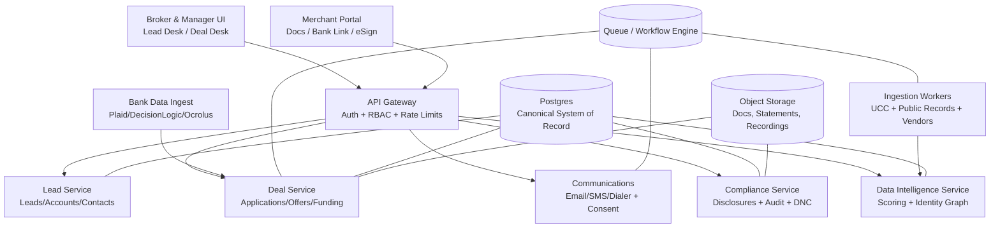

# Deep Research Report on `labores-profani-crux/public-record-data-scrapper` and Expansion into a Full MCA Brokerage Suite

## Executive synthesis

The GitHub repository is best understood as an early-stage **UCC-to-prospect intelligence prototype**: it contains a credible scaffolding for multi-state UCC scraping (notably four concrete state scrapers wired into an “agent” abstraction), a UI oriented around **prospect triage** (filters, scoring, claim/unclaim, notes/reminders, a lightweight email-compose flow), and an aspirational “platform” envelope (Express API, BullMQ workers, Redis, Postgres). fileciteturn55file0turn81file0turn82file0turn89file0

At the same time, the codebase shows repeated signals of being **mid-consolidation** rather than production-ready: multiple parallel database layers exist, and there are **material inconsistencies between DB schema/migrations and server-side SQL usage**, plus multiple “mock” implementations where “real” integrations are implied. fileciteturn19file0turn20file0turn50file0turn53file0turn54file0turn60file0turn70file0turn79file0

The attached MCA lead-generation document frames the real-world brokerage environment as a **high-velocity acquisition-and-conversion machine** where competitive advantage comes from: (a) lead sourcing that signals _intent + health + position_, (b) speed-to-lead and multi-channel outreach at scale, (c) underwriting pre-checks focused on bank-statement-derived liquidity/behavior (ADB, NSFs/negative days, existing “stack” position), and (d) an increasingly important compliance posture (telemarketing rules/DNC practices, commercial financing disclosure regimes, vendor oversight). (User-provided document; analyzed directly from the attachment.)

A credible “full MCA suite” evolution is therefore feasible—but only if the repository is first stabilized into a **single coherent system of record** (one DB schema + one access layer + one canonical domain model), and then expanded into an operating system for brokerage workflows: lead intake → qualification → lender matching → offer generation → disclosures & consent → closing → funding → renewals/servicing. The market already has multiple MCA CRMs and end-to-end platforms (Centrex, MCA Suite, LendSaaS, Ricochet360, etc.), but there remains an opportunity to differentiate on **public-record intelligence + compliance-by-design + explainable underwriting signals + data quality/identity resolution**. citeturn0search1turn3search8turn1search2turn3search5turn0search6turn1search0turn2search11

## Deep technical review of the GitHub repository

### System shape and major components

The repository is a TypeScript monorepo-like layout with a React/Vite frontend and a Node/Express server; `package.json` includes dependencies consistent with: UI (React), job queueing (BullMQ), and data stores (Postgres via `pg`, Redis via `ioredis`). fileciteturn3file0

The server entrypoint constructs an Express application with `helmet`, `cors`, compression, request logging, a rate limiter, and an auth middleware wrapper around most routes (`/api/prospects`, `/api/competitors`, `/api/portfolio`, `/api/enrichment`, `/api/jobs`). fileciteturn89file0turn5file0turn6file0  
However, the repo’s own security guide explicitly states that **authentication/authorization is not implemented** and treats it as a production blocker (P0), despite a JWT-based middleware existing in code. This is a classic prototype gap: “present” but not production-complete (no RBAC model, sessions, tenanting, etc.). fileciteturn80file0turn6file0

### Scraping architecture and “public record” capability

#### What is actually implemented

The most concrete “scraper” capability is delivered via the `ScraperAgent`, which registers four state-specific scrapers—California, Texas, Florida, New York—and exposes tasks like `scrape-ucc` and `get-manual-url`. fileciteturn55file0  
Each of those scrapers lives under `scripts/scrapers/states/` and extends a common `BaseScraper` that centralizes validation, error handling, retries, and parsing error reporting. fileciteturn9file0turn39file0turn40file0turn41file0turn10file0

This design has real strengths:

- It enforces a **single contract** for search results (`ScraperResult`/filings arrays) and makes scraper failures observable (error plus parsing errors), which is essential for any scraping operation that will face DOM drift and intermittent portal breakage. fileciteturn10file0turn55file0
- The state scrapers attempt to encode the “hard parts” explicitly: terms acceptance flows (Florida), login flows (Texas), and frame-based portals (New York via a Playwright-based helper). fileciteturn41file0turn40file0turn42file0turn48file0

#### Key limitations for real-world UCC monitoring

Despite the promising structure, several issues limit performance as a true production “public record data scraper”:

- **Coverage is far from 50 states.** A large `StateAgentFactory` exists with many state portal URLs, but it does not imply functioning UCC collection. The collection/orchestration layer is largely simulated. fileciteturn47file0turn48file0turn46file0
- **Scraping robustness risks:**
  - California’s scraper encodes many selectors and heuristics, but like most DOM-driven scrapers it will be brittle to portal HTML changes. It attempts pagination detection via a generic `PaginationHandler`, which is good practice, but it is still heuristic-driven. fileciteturn39file0turn38file0
  - Texas’ scraper includes placeholder assumptions about login URL and selectors and therefore likely requires environment-specific tuning before it can run reliably. fileciteturn40file0turn13file0
  - New York’s `NYUCCPortalScraper` is presented as a “reference implementation” with unimplemented methods for key searches, meaning that “full NY coverage” is not complete. fileciteturn42file0
- **Operationalization is incomplete.** The server-side ingestion worker explicitly says “Phase 2 will implement actual scraping” and currently simulates ingestion; critically, it attempts to write to a table name and columns that do not match the provided schema, which would fail at runtime. fileciteturn51file0turn19file0

#### The repository’s own “production path” insight

A valuable architectural clue is the `ScraperFactory`, which formalizes three implementations—mock, puppeteer, and **API**—and recommends API usage for production, highlighting “legal and compliant” access and “covers all states.” fileciteturn84file0  
The API scraper (`CaliforniaUCCScraperAPI`) is still a template (provider-specific mapping is explicitly “needs customization”), but it correctly captures a core reality: if you want national scale, reliability, and defensibility, **paid data providers and/or official APIs** will often outperform scraping. fileciteturn85file0

### Data model, persistence, and codebase consistency

The repo contains a fairly detailed Postgres schema and migration. fileciteturn19file0turn20file0  
But multiple parallel DB layers exist:

- `database/schema.sql` + `database/migrations/001_initial_schema.sql` (SQL-first schema) fileciteturn19file0turn20file0
- `server/database/connection` and server-side services issuing SQL that assumes a different schema (for example, different prospect status values and fields). fileciteturn54file0turn86file0turn53file0turn51file0
- `src/lib/database/*` (a “DatabaseClient + QueryBuilder” abstraction) whose table/column usage does not match the SQL schema. fileciteturn60file0turn70file0turn19file0
- `src/lib/db/*` (a second, simpler pool-based DB module) with types that _do_ resemble the SQL schema. fileciteturn78file0turn79file0turn76file0turn19file0

This fragmentation is not just stylistic—it creates hard blockers:

- **Schema triggers appear incorrect.** The migration defines triggers on `ucc_filings` that execute `normalize_company_name()`, but that function sets `NEW.company_name_normalized`, which is not a column on `ucc_filings` (it has `debtor_name_normalized` / `secured_party_normalized`). This would break inserts/updates. fileciteturn20file0turn19file0
- **Server services do not match schema constraints.** Example: they use statuses like `unclaimed`, while the schema uses `new` (and other statuses). fileciteturn54file0turn86file0turn19file0
- **Enrichment writes do not match required columns.** Example: inserting growth signals without required fields (`score`) and using `permits` where schema enumerates `permit`. fileciteturn53file0turn19file0

Net assessment: the database layer is the single largest technical debt cluster; stabilizing it is prerequisite to building an MCA suite.

### Frontend functionality and current “lead desk” UX

The UI is the most cohesive module today: it supports prospect table/grid browsing, filtering, sorting, selection, and batch operations (claim/export/delete). fileciteturn81file0  
The prospect detail affordance is also meaningfully aligned with broker workflows: it emphasizes a “priority score,” health grade, default history, UCC filings, and includes notes/reminders plus a basic email send flow. fileciteturn82file0turn83file0turn75file0

However, persistence and multi-user readiness are not yet there:

- Notes/reminders are stored via a key-value layer (`useSparkKV`) using “Current User” placeholders, which is not suitable for multi-rep brokerages without a real identity model, auditability, or concurrency controls. fileciteturn83file0turn80file0
- Several “pipeline” services assume a database service that appears incomplete or inconsistent (missing exported row types, etc.), indicating that “real data mode” likely fails or falls back to mock data. fileciteturn91file0turn63file0turn60file0

### Code quality and security posture

Strengths:

- There is explicit emphasis on input sanitization and secure coding practices in documentation; the security guide claims dedicated sanitization utilities and enumerates planned security headers, audit logging, and RBAC. fileciteturn80file0
- Server middleware patterns are solid “defaults” (Helmet, CORS, compression, structured routing). fileciteturn89file0

Critical weaknesses (blocking for broker-grade suite use):

- **Authentication/authorization is not production-complete** per the repo’s own security document. fileciteturn80file0turn6file0
- **Audit logging and compliance-grade traceability are not implemented** (and are non-optional in a world of lead-vendor liability, telemarketing compliance needs, and disclosure compliance). fileciteturn80file0turn1search0turn0search6
- **Data correctness risk:** the systemic schema/service mismatch means you cannot trust stored metrics; in an MCA context that becomes underwriting and compliance risk, not just “bugs.” fileciteturn19file0turn53file0turn54file0turn51file0

## MCA lead-generation document requirements distilled into product capabilities

The attached document describes the MCA acquisition ecosystem as a pipeline whose economic viability depends on: sourcing appropriate “intent + health + position” leads; converting through contact → submission → approval → take-rate; and operating under mounting regulatory and reputational risk. (User-provided document; interpreted as requirements.)

Translated into **software requirements**, the document implies the platform must do more than scrape UCC filings:

- Lead sourcing must support multiple channels and economics, including UCC-derived triggers (recency by state), inbound web leads, aged leads/reactivation, and partner referrals.
- Lead scoring must incorporate underwriting-relevant “health” indicators (especially cash-flow resilience) and “position” (stack depth).
- Workflow must deliver speed-to-lead: instant routing, outreach automation, multi-touch follow-up.
- Compliance must be built-in: DNC suppression practices and recordkeeping, consent tracking for SMS/calls, vendor oversight and attribution, and state-level commercial financing disclosures.

Several of these requirements are anchored by authoritative regimes:

- **Telemarketing Sales Rule (TSR) / DNC mechanics** and penalties—FTC guidance stresses DNC list management and civil penalties per violation, and the prohibition on misusing registry data. citeturn1search0turn1search4
- **TCPA private right of action** provides $500 statutory damages per violation and permits trebling for willful/knowing violations. citeturn2search11
- **Commercial financing disclosure laws**—California’s DFPI explains SB 1235 requires disclosures at the time a specific offer is extended for commercial financing, including MCAs. citeturn0search6turn0search11

## Mapping the repository to MCA brokerage workflows

The table below maps the current repository’s capabilities to the operational requirements implied by the MCA lead-generation document, emphasizing what exists versus what must be built.

| MCA capability area (from the document’s implied needs)  | What the repo provides today                                                                                                                                      |        Fit | Expansion needed to reach “brokerage suite”                                                                                                                                                                                                                                               |
| -------------------------------------------------------- | ----------------------------------------------------------------------------------------------------------------------------------------------------------------- | ---------: | ----------------------------------------------------------------------------------------------------------------------------------------------------------------------------------------------------------------------------------------------------------------------------------------- |
| Public record ingestion: UCC monitoring                  | Concrete scrapers for CA/TX/FL/NY wired into `ScraperAgent`; shared retry/validation base. fileciteturn55file0turn39file0turn40file0turn41file0turn10file0 |     Medium | Scale to 50 states through a hybrid strategy: vendor APIs + selective scraping; robust change detection; per-state rate-limit policies; scraper observability and automated repair workflows. fileciteturn84file0turn85file0                                                          |
| “Intent signals” and timing                              | UI emphasizes priority score and default history; UCC filings displayed. fileciteturn82file0turn75file0                                                       |     Medium | Implement actual “recency windows” and “position inference” (first/second/third position), plus rules for real-time alerting, routing, and SLA enforcement.                                                                                                                               |
| Lead management (basic CRM)                              | Prospect list, filtering, sorting, batch claim/export/delete. fileciteturn81file0turn82file0                                                                  |     Medium | Replace local KV “notes/reminders” with multi-tenant DB + RBAC. Add pipeline stages aligned to MCA lifecycle (new → contacted → submitted → approved → funded → renewal). fileciteturn83file0turn80file0turn75file0                                                                  |
| Outreach workflows (email/SMS/calling)                   | Basic “send email” UI action; no dialer/SMS/consent engine. fileciteturn82file0turn75file0                                                                    |        Low | Integrate dialer + SMS + email sequencing; contact attempt logging; DNC suppression; consent capture and proofs; attribution by lead source and rep. citeturn1search0turn2search11                                                                                                    |
| Underwriting pre-checks (ADB, NSFs, cash-flow)           | Only placeholder “health scores” and enrichment stubs; no bank statement ingestion or analytics. fileciteturn90file0turn53file0                               |        Low | Implement bank statement capture (merchant portal), analysis, and rule engine for ADB/NSF/negative days; integrate bank-data providers. citeturn0search12turn0search4turn2search1turn2search0                                                                                       |
| Deal structuring (factor rate, payback, terms)           | No real offer/pricing engine (only generic UCC and prospect objects). fileciteturn75file0                                                                      |        Low | Create “Offer Engine” with factor, term, fees, remittance/payment schedules; lender-specific boxes and program rules; auto-generated offer documents. Compare to platforms that already expose these features (e.g., Centrex “Advance Overview” fields). citeturn0search7turn0search1 |
| Compliance: state disclosure laws                        | No disclosure module. fileciteturn80file0                                                                                                                      |        Low | Implement disclosure templates and calculators for CA SB 1235 and other state regimes, with signature capture and immutable retention. citeturn0search6turn0search11turn0search5                                                                                                     |
| Compliance: telemarketing/DNC/TSR                        | Not implemented; security guide highlights missing audit logging and auth/RBAC. fileciteturn80file0                                                            |        Low | Add DNC list subscription support, suppression auditing, call/SMS consent governance, and vendor “vicarious liability” controls via attribution + contractual evidence. citeturn1search0turn1search4turn2search11                                                                    |
| Data pipeline operations (queues, ingestion, enrichment) | BullMQ workers exist but several are explicit simulations and appear schema-incompatible. fileciteturn51file0turn52file0turn53file0turn19file0              | Low–Medium | Rebuild the pipeline around a canonical schema plus event-driven ingestion; enforce idempotency; add observability; productionize rate limiting and cost tracking (as suggested in mock collectors). fileciteturn49file0turn50file0turn80file0                                       |

## How to evolve the repository into a full MCA suite

### Stabilize the foundation before adding features

A brokerage-grade system needs a single “truth layer.” The fastest path is:

- Adopt **one canonical relational schema** (Postgres), choose one migration system, and delete/merge parallel DB modules. Today, three competing DB clients exist and are inconsistent. fileciteturn19file0turn54file0turn60file0turn70file0turn79file0
- Make the server the **authoritative system of record** and treat the React UI as a client. Today, important functions (notes/reminders) are effectively client-local. fileciteturn83file0turn80file0
- Fix schema correctness issues (notably the trigger mismatch in migrations) before adding higher-level MCA complexity. fileciteturn20file0turn19file0

### Recommended target architecture

The repo already hints at an event-driven shape (BullMQ + Redis + workers). The target MCA suite can retain that pattern, but with clean boundaries.

This diagram aligns with what established MCA platforms advertise—pipeline/advance management, lender submissions, portals, commissions—while explicitly adding “public record intelligence” and compliance-by-design as differentiators. citeturn0search1turn3search8turn1search2turn3search5

### Missing modules to reach “full MCA brokerage platform”

The repository already has proto-entities like prospects, signals, and UCC filings. fileciteturn19file0turn75file0turn82file0  
To become a full suite, you will need at minimum:

- **Identity & contact graph:** canonical “Business Entity” (legal name variants, DBA, EIN when available, addresses, phones/emails, owners/officers) plus deduping and survivorship rules.
- **Lead source and attribution ledger:** tracking cost per lead, exclusivity, timestamps, and downstream funnel performance (contact → submission → approval → take-rate).
- **Deal pipeline domain model:** application package (“the pack”), lender submissions, offers, counteroffers, stipulations, funding status, renewal eligibility, stacking position, and lender/ISO commission splits.
- **Underwriting data plane:** secure bank statement ingestion and analytics (ADB, NSFs/OD fees, negatives, daily deposits), plus detection of existing lender payments to infer stack position. Tools like Ocrolus explicitly provide bank statement analytics such as NSF calculations, large deposits, and balances. citeturn0search3turn0search4turn0search12
- **Disclosure automation and compliance evidence:** state commercial financing disclosures (starting with CA SB 1235), signature capture, immutable retention, and audit trails. citeturn0search6turn0search11
- **Communications + consent governance:** dialer integration, SMS/email campaigns, opt-out handling, DNC suppression, call recording metadata, and proof of consent where required. FTC TSR guidance and the TCPA statutory damages regime make this non-optional. citeturn1search0turn2search11

### Architectural and technological enhancements

The repository contains good “directional” documentation for security hardening—RBAC, distributed rate limiting, audit logs, encryption at rest—but it is not yet implemented. fileciteturn80file0turn89file0  
To support new MCA-suite modules, recommended upgrades are:

- Replace ad-hoc job scheduling with a **workflow engine** (or at minimum BullMQ + strict job schemas + idempotency keys) to manage scraping schedules, retry policies, and SLA-based lead routing. The current worker code is explicitly “simulated,” so it’s safe to refactor now. fileciteturn51file0turn52file0
- Introduce **tenant-aware RBAC** (brokerage → team → rep) with “need-to-know” access for sensitive financial docs. The repo’s security guide already frames RBAC roles and audit logging as required. fileciteturn80file0turn89file0
- Implement an **audit log** and immutable event ledger (who imported what lead, who called/texted, what disclosure was presented, what the merchant signed, which vendor supplied the lead). This is both operationally useful and a legal defense asset. fileciteturn80file0turn1search0turn1search4
- Build a **compliance rules engine** that can encode “do not contact,” “disclosure required,” and “prohibited claim” policies per state, per channel. California’s DFPI disclosure requirements are explicit about what must be presented at the time of a specific offer. citeturn0search6turn0search11

## Competitive landscape and comparative analysis

### Competitive comparison table

The MCA software market includes both end-to-end MCA platforms and MCA-specific CRMs with dialer/automation. The table below summarizes representative solutions and what they publicly claim.

| Product                               | Category                                      | Publicly described strengths                                                                                                                                                                            | Pricing model (public)                                             | Notable limitations (from public info / implications)                                                                                                             |
| ------------------------------------- | --------------------------------------------- | ------------------------------------------------------------------------------------------------------------------------------------------------------------------------------------------------------- | ------------------------------------------------------------------ | ----------------------------------------------------------------------------------------------------------------------------------------------------------------- |
| Centrex                               | MCA CRM + portals + submissions + commissions | Pipeline management, lender submissions, commission tracking, customer portal/mobile app; also references texting/email marketing and eSign capabilities. citeturn0search1turn0search7turn0search9 | “Request demo” (not public on cited pages). citeturn0search1    | Differentiation depends on integrations and data quality; public pages don’t emphasize public-record intelligence as a core moat. citeturn0search1             |
| LendSaaS                              | End-to-end MCA origination + servicing        | End-to-end platform; underwriting processes; bank statement parsing; automated collections and syndication. citeturn1search2turn3search6                                                            | “Schedule/demo” (not public). citeturn1search2                  | If you’re a broker-only shop, a funder-grade platform may be heavier than necessary; limited public detail on broker-first lead intelligence. citeturn1search2 |
| MCA Suite                             | MCA CRM for brokers & funders                 | Deal tracking, lead management, submission tracking, commission tracking, portals, syndication, document storage, ACH integrations. citeturn3search8                                                 | Not shown on cited page. citeturn3search8                       | Public positioning emphasizes ops completeness; less emphasis on unique public-record ingestion/scoring as a first-class feature. citeturn3search8             |
| Ricochet360                           | MCA CRM + dialer + automation                 | “Ultra-fast cloud dialer,” lead management, dashboards, integrations/APIs, secure cloud access. citeturn3search5                                                                                     | Not shown on cited page. citeturn3search5                       | Dialer-centric value prop; may not solve underwriting intelligence and disclosure automation deeply without add-ons. citeturn3search5                          |
| Easify CRM                            | All-in-one MCA CRM + dialer + marketing       | Claims full lifecycle coverage, ISO portal, email/text/RVM marketing suite “powered by AI,” security claims. citeturn3search4                                                                        | 14-day trial; pricing not shown on cited page. citeturn3search4 | Marketing automation is not the same as compliance governance; “AI” claims require validation in diligence. citeturn3search4                                   |
| SmartMCA                              | End-to-end MCA platform                       | Emphasizes workflow automation, reporting, integrations, “Seamless CRM.” citeturn3search9                                                                                                            | Not shown on cited page. citeturn3search9                       | Public info is high-level; feature depth (disclosures, consent, vendor attribution) unclear without demo. citeturn3search9                                     |
| Fundara                               | Broker-focused MCA platform                   | Positions around AI underwriting, dialer integrations, flow builder; “start free today.” citeturn3search0                                                                                            | Not specified on cited page. citeturn3search0                   | Early-stage style marketing claims; must validate auditability, compliance tooling, and data lineage in practice. citeturn3search0                             |
| Cloudsquare Broker (Salesforce-based) | MCA CRM / broker LOS (Salesforce ecosystem)   | Salesforce-based MCA CRM/LOS positioning; mentions lender API framework (via announcement). citeturn3search2                                                                                         | Not shown on cited page. citeturn3search2                       | Often implies higher implementation cost/complexity (Salesforce admin, customization). citeturn3search2                                                        |
| ConvergeHub (MCA template)            | CRM tailored page                             | Deal tracking, partner collaboration, templates, fees/commissions, renewals, reports/automation. citeturn3search10                                                                                   | Not shown on cited page. citeturn3search10                      | May be “general CRM + vertical packaging” vs deeply MCA-native disclosures/underwriting/servicing. citeturn3search10                                           |
| Neofin                                | MCA/workflow automation platform              | Positions as “full MCA workflow automation” from origination through repayment; mentions compliance tools and audit-ready reporting. citeturn3search14                                               | Not shown on cited page. citeturn3search14                      | Requires validation: “compliance tools” breadth and per-state disclosure support is often where platforms differ. citeturn3search14                            |

### Market gap analysis and differentiation opportunities

Across the market, platforms strongly emphasize **pipeline + submissions + portals + dialing/automation**. citeturn0search1turn3search8turn3search5turn3search4turn1search2  
Less consistently emphasized (and therefore a credible gap for differentiation) are:

- **Public-record intelligence as a first-class engine:** Most MCA CRMs talk about managing leads, not originating superior leads via UCC/public-record signal fusion. Your repo’s DNA is exactly this differentiator—if stabilized and scaled. fileciteturn55file0turn39file0turn84file0
- **Compliance-by-design workflows:** FTC TSR guidance highlights strict DNC list requirements and penalties; TCPA allows statutory damages and trebling; and state commercial financing disclosures require specific offer-time disclosures. Platforms often market “compliance,” but a verifiable compliance evidence layer (audit + proofs + vendor attribution) remains uneven and is a strong enterprise wedge. citeturn1search0turn1search4turn2search11turn0search6turn0search11
- **Explainable underwriting signals that bridge “lead gen” and “credit”:** The attached document stresses underwriting health (ADB/NSF/negative days) and stack position; most CRMs require bolt-on tooling. Meanwhile, bank-data vendors like Ocrolus and DecisionLogic explicitly describe analytics outputs and workflows that can be embedded. citeturn0search3turn0search4turn0search12turn2search1turn2search0
- **Identity resolution and deduplication at scale:** UCC debtor naming is messy. A brokerage suite that builds a “business identity graph” (variants, addresses, owner/officer links) will reduce wasted dials and improve compliance suppression accuracy.

## Data sources, integrations, and compliance/security/scalability considerations

### Data sources and integrations that materially strengthen an MCA suite

To align the repo’s “public record scraping” strength with the underwriting and conversion realities described in the MCA document, prioritize:

- **UCC data at scale via vendor APIs or official channels** rather than pure scraping. The repo already lists commercial providers (e.g., UCC Plus) and positions API access as “recommended production approach.” fileciteturn85file0turn84file0
- **Bank data ingestion + analytics** via established vendors:
  - Ocrolus provides bank-statement analytics (e.g., NSF calculations) and an embedded workflow for bank statement income analysis; it also documents integration patterns like Ocrolus + Plaid. citeturn0search4turn0search12turn0search20
  - DecisionLogic describes real-time bank verification plus up to 365 days of transaction history and analytics, delivered via “send a link → customer opts in” workflow. citeturn2search0turn2search1turn2search3
- **Disclosure automation tooling** aligned to state regimes:
  - California DFPI explains SB 1235’s disclosure obligations for commercial financing including MCA. citeturn0search6turn0search11
  - If expanding beyond CA, the legal trend is multi-state disclosure requirements (California, New York, Utah, Virginia are frequently cited together in policy analysis). citeturn0search5turn0search22
- **Communications stack** (email/SMS/dialer) with compliance hooks: whichever provider is chosen, you need robust logging, opt-out enforcement, and message/call attribution as first-class data.

### Compliance and risk controls that should be designed in, not bolted on

Because the MCA document emphasizes regulatory hostility around lead gen and calling tactics, the software should treat compliance as a product feature:

- **DNC/TSR governance:** FTC guidance explicitly requires honoring DNC lists and outlines civil penalties for violations, plus restrictions on use of the National Registry. citeturn1search0turn1search4
- **TCPA consent evidence:** TCPA statutory damages ($500 per violation, trebling up to 3× for willful/knowing) should drive a “consent ledger” and automated suppression engine. citeturn2search11
- **Commercial financing disclosure evidence:** For CA, DFPI describes required disclosures and timing; you need automatic disclosure generation bound to the specific offer version and a signed acknowledgement stored immutably. citeturn0search6turn0search11
- **Vendor oversight & attribution:** Operationally, track which lead vendor/source produced each lead, what consent representations were made, and keep artifacts. This is essential in a world of “vicarious liability” narratives and enforcement focus (the repo’s current lack of audit logging is a known gap). fileciteturn80file0turn1search0

### Scalability considerations

The repo’s own CA collector notes the reality of massive record volumes and rate limits/cost-per-request dynamics (even though the collector is mocked). fileciteturn49file0  
For a scaled MCA suite, design for:

- **High-ingestion + strict idempotency:** repeated pulls from UCC/public sources must not create duplicates; use deterministic external IDs + upsert patterns.
- **Partitioning and indexing:** UCC and events tables will become large; consider time-based partitioning and carefully designed indexes for debtor name normalization and state/date queries.
- **Observability and runtime safety:** scraping and vendor API calls require structured metrics (success rate by state, DOM drift errors, captcha detection counts), plus circuit breakers.

### Practical conclusion

As it stands, the repository demonstrates a _strategic direction_ (public-record/UCC intelligence feeding a broker-friendly prospect desk) but does not yet qualify as a reliable “public record data scraper” at production standards due to incomplete orchestration and schema/service inconsistencies. fileciteturn51file0turn19file0turn54file0turn60file0turn80file0

If your objective is a “full MCA suite,” the most viable path is:

- Treat the current repo as a **prototype reference** for (a) UI/UX patterns and (b) early scraper scaffolding,
- Then invest in a consolidation phase (canonical schema, auth/RBAC, audit logging), followed by expansion into underwriting + disclosures + communications governance,
- While differentiating in the market on **public-record intelligence + compliance evidence + explainable underwriting signals**—a gap that many MCA CRMs and platforms do not highlight as their primary moat. citeturn0search1turn3search8turn1search2turn1search0turn2search11turn0search6turn0search11
